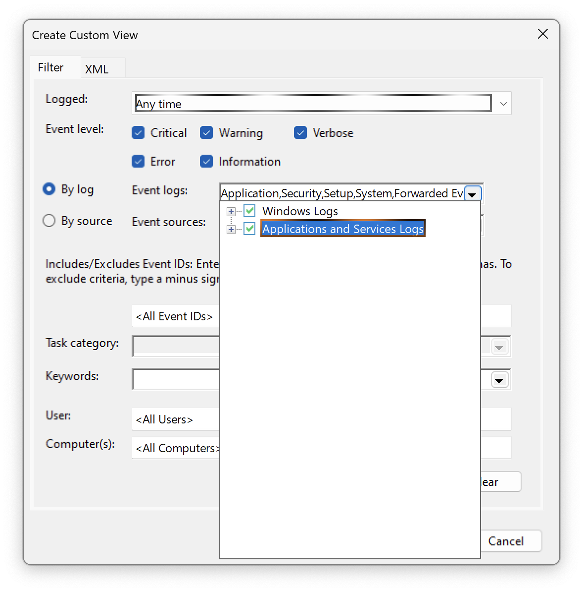

import ThemedImage from '@theme/ThemedImage';

# Viewing Nebula Logs

This guide explains how to view logs for Nebula in each of the supported platforms. Please note that these instructions
are approximations as there are many ways that Nebula can be installed.

## Linux

:::note

These instructions assume that you either installed Nebula using your distribution's package manager or by copying the
[example systemd unit](https://github.com/slackhq/nebula/blob/master/examples/service_scripts/nebula.service) from the
Github repository.

:::

### Logs

```bash
journalctl --unit=nebula --follow
```

### Service status

```bash
systemctl status nebula
```

```bash
# outputs
● nebula.service - Nebula overlay networking tool
     Loaded: loaded (/etc/systemd/system/nebula.service; enabled; vendor preset: enabled)
     Active: active (running) since Wed 2022-11-30 16:07:48 CST; 2min 3s ago
   Main PID: 546 (nebula)
      Tasks: 10 (limit: 4560)
     Memory: 19.2M
     CGroup: /system.slice/nebula.service
             └─546 /usr/local/bin/nebula -config /etc/nebula/config.yml

# ... shows nebula logs ...
```

## macOS

:::note

These instructions assume that Nebula was installed using `brew install nebula` on Apple Silicon.

On Intel processors, Homebrew uses `/usr/local` instead of `/opt/homebrew` as a default prefix.

:::

### Logs

```bash
sudo tail -f /opt/homebrew/var/log/nebula.*
```

Another useful tool for viewing logs is the built-in [Console.app](https://support.apple.com/guide/console/welcome/mac).
To access the logs, To access the logs, select `File -> Open` from the menu and then press

<kbd>Cmd</kbd> + <kbd>Shift</kbd> + <kbd>G</kbd> in the file picker, which will allow you to enter `/opt/homebrew/var/log/nebula.log`
into the textbox.

### Service status

```bash
launchctl list homebrew.mxcl.nebula
```

```bash
{
	"StandardOutPath" = "/opt/homebrew/var/log/nebula.log";
	"LimitLoadToSessionType" = "Aqua";
	"StandardErrorPath" = "/opt/homebrew/var/log/nebula.log";
	"Label" = "homebrew.mxcl.nebula";
	"OnDemand" = false;
	"LastExitStatus" = 256;
	"Program" = "/opt/homebrew/opt/nebula/bin/nebula";
	"ProgramArguments" = (
		"/opt/homebrew/opt/nebula/bin/nebula";
		"-config";
		"/opt/homebrew/etc/nebula/config.yml";
	);
};
```

## Windows

:::note

These instructions assume that Nebula was installed using the `nebula service install` command.

:::

### Logs

Open the Event Viewer app, click on Custom Views -> Administrative Events -> manually enter `nebula` for "Event
sources".

You can also make a "Custom View" which filters on the `nebula` source.




### Service status

To check the status of the service, open Services app, and find the Defined Networking Client service in the list. You
should be able to see the status and start or stop the service.

<ThemedImage
  style={{ maxWidth: 650, width: '100%', marginInline: 'auto', display: 'block' }}
  alt="Services app showing the status of the nebula service"
  loading="lazy"
  sources={{
    light: require('./windows-nebula-service-status.png').default,
    dark: require('./windows-nebula-service-status.png').default,
  }}
/>

## Android / iOS

### Logs

Tap on the site in question and tap "View Logs" on the details page for that site. You can then read, share, or delete
your logs.

:::info

Logs are cleared each time a site is started.

:::

<ThemedImage
  className="screenshot-shadow"
  style={{ maxWidth: 390, width: '100%', marginInline: 'auto', display: 'block' }}
  alt="Nebula site details page in the mobile app, shows a 'Logs' option third from the top"
  loading="lazy"
  sources={{
    light: require('./viewing-logs-on-mobile.png').default,
    dark: require('./viewing-logs-on-mobile.png').default,
  }}
/>
